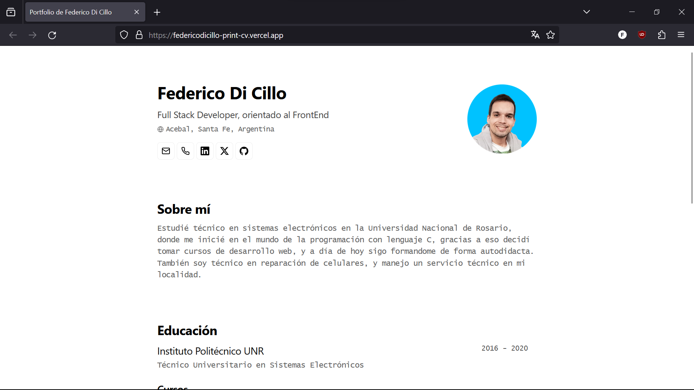

 
<h2>
    <em>Résumé</em> minimalista maquetado para web y pdf
</h2>

Esquema del JSON de CV de <a href="https://jsonresume.org/schema/">jsonresume.org</a>

Basado en el diseño de <a href="https://github.com/midudev/minimalist-portfolio-json">Miguel Ángel Durán</a>
<a href="https://midu.dev"> (Midudev)</a>

    <a href="#🚀-empezar">
        Empezar
    </a>
    &nbsp;✦&nbsp;
    <a href="#🔑-licencia">
        Licencia
    </a>
   

</img>

## 🛠️ Stack

- [**Angular**](https://angular.io/) - El framework web de la nueva época.
- [**Typescript**](https://www.typescriptlang.org/) - JavaScript con sintaxis de tipado.

# MinimalistPortfolio

This project was generated with [Angular CLI](https://github.com/angular/angular-cli) version 17.0.1.

## Development server

Run `ng serve` for a dev server. Navigate to `http://localhost:4200/`. The application will automatically reload if you change any of the source files.

## Code scaffolding

Run `ng generate component component-name` to generate a new component. You can also use `ng generate directive|pipe|service|class|guard|interface|enum|module`.

## Build

Run `ng build` to build the project. The build artifacts will be stored in the `dist/` directory.

## Running unit tests

Run `ng test` to execute the unit tests via [Karma](https://karma-runner.github.io).

## Running end-to-end tests

Run `ng e2e` to execute the end-to-end tests via a platform of your choice. To use this command, you need to first add a package that implements end-to-end testing capabilities.

## Further help

To get more help on the Angular CLI use `ng help` or go check out the [Angular CLI Overview and Command Reference](https://angular.io/cli) page.
